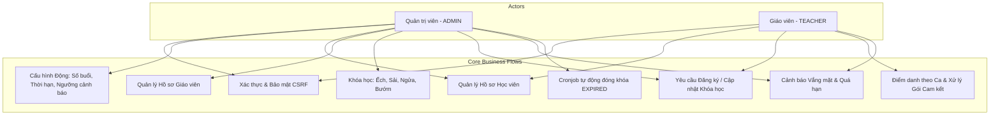
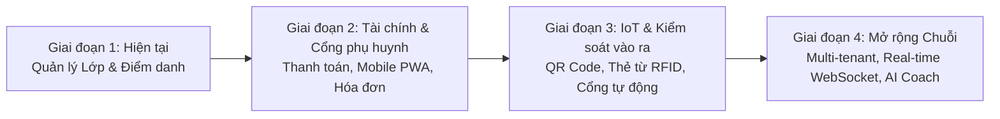

# 🏊 Swimming Pool Management System (AquaManage)
> **Hệ thống Quản lý Bể bơi & Khóa học Bơi Toàn diện**  
> Giải pháp số hóa quy trình quản lý học viên, giáo viên, điểm danh ca học, phê duyệt yêu cầu và cảnh báo tự động cho các trung tâm dạy bơi và bể bơi thương mại.

---

## 📌 Mục lục
- [1. Giới thiệu Tổng quan](#1-giới-thiệu-tổng-quan)
- [2. Kiến trúc & Công nghệ (Tech Stack)](#2-kiến-trúc--công-nghệ-tech-stack)
- [3. Phân quyền & Mô hình Nghiệp vụ Cốt lõi](#3-phân-quyền--mô-hình-nghiệp-vụ-cốt-lõi)
  - [3.1. Phân quyền Người dùng (RBAC)](#31-phân-quyền-người-dùng-rbac)
  - [3.2. Quản lý Khóa học & Gói Bơi (Enrollments)](#32-quản-lý-khóa-học--gói-bơi-enrollments)
  - [3.3. Điểm danh & Ca học (Attendance & Shifts)](#33-điểm-danh--ca-học-attendance--shifts)
  - [3.4. Quy trình Đề xuất & Phê duyệt (Request-Approval Workflow)](#34-quy-trình-đề-xuất--phê-duyệt-request-approval-workflow)
  - [3.5. Hệ thống Cảnh báo Thông minh & Tự động hóa (Alerts & Cronjobs)](#35-hệ-thống-cảnh-báo-thông-minh--tự-động-hóa-alerts--cronjobs)
  - [3.6. Cấu hình Hệ thống Động (Dynamic System Settings)](#36-cấu-hình-hệ-thống-động-dynamic-system-settings)
- [4. Cấu trúc Thư mục Dự án](#4-cấu-trúc-thư-mục-dự-án)
- [5. Hướng dẫn Cài đặt & Khởi chạy](#5-hướng-dẫn-cài-đặt--khởi-chạy)
  - [5.1. Yêu cầu Tiên quyết](#51-yêu-cầu-tiên-quyết)
  - [5.2. Khởi chạy Database (PostgreSQL & Docker)](#52-khởi-chạy-database-postgresql--docker)
  - [5.3. Khởi chạy Backend (Spring Boot)](#53-khởi-chạy-backend-spring-boot)
  - [5.4. Khởi chạy Frontend (React + Vite)](#54-khởi-chạy-frontend-react--vite)
- [6. Kiểm thử Tự động & CI/CD (Testing & Quality)](#6-kiểm-thử-tự-động--cicd-testing--quality)
- [7. Tổng hợp Danh mục API](#7-tổng-hợp-danh-mục-api)
- [8. Kế hoạch Phát triển & Cải tiến Tương lai (Future Roadmap)](#8-kế-hoạch-phát-triển--cải-tiến-tương-lai-future-roadmap)

---

## 1. Giới thiệu Tổng quan

**Swimming Pool Management System** là nền tảng quản lý chuyên sâu được thiết kế để giải quyết triệt để các bài toán vận hành tại bể bơi và câu lạc bộ bơi lội:
- Loại bỏ hoàn toàn sổ sách điểm danh thủ công, sai lệch số buổi học giữa giáo viên và trung tâm.
- Quản lý chặt chẽ mô hình **Gói cam kết (dạy đến khi biết bơi)** và **Gói thường (theo số buổi cố định)**.
- Phân công linh hoạt mô hình **Đồng giảng dạy (Co-teaching)**: 1 lớp có thể có nhiều giáo viên cùng phụ trách.
- Tự động hóa việc phát hiện học viên vắng học lâu ngày và khóa học sắp hết hạn hiệu lực.
- Quy trình phối hợp mượt mà giữa Giáo viên (đề xuất) và Ban Quản trị (duyệt và điều phối).

---

## 2. Kiến trúc & Công nghệ (Tech Stack)

### 🖥️ Backend
- **Ngôn ngữ & Framework**: Java 21 LTS, Spring Boot 4.1.0 / 3.x
- **Bảo mật & Xác thực**: Spring Security, Cookie-based Session, CSRF Protection (`CookieCsrfTokenRepository`), Login Rate Limiter chống brute-force.
- **Cơ sở dữ liệu & ORM**: PostgreSQL 15+, Spring Data JPA, Hibernate 7, Flyway Database Migration.
- **Tiện ích**: Lombok, Slf4j, MapStruct/DTO Pattern, Bean Validation (`jakarta.validation`).
- **Kiểm thử**: JUnit 5, Mockito, AssertJ (100% Mock Unit Testing cho Business Services).

### 🎨 Frontend
- **Framework & Core**: React 18, Vite 6, React Router v6.
- **Giao diện & Styling**: Tailwind CSS, Lucide React Icons, Glassmorphism, Micro-animations.
- **Biểu đồ & Thống kê**: Recharts (Biểu đồ cột, biểu đồ xu hướng theo tuần/tháng).
- **Quản lý Trạng thái & API**: Zustand (Auth Store), Axios (Custom interceptors xử lý CSRF & Auto-unwrap).
- **Trải nghiệm người dùng**: Dynamic Settings Caching, Debounced Search, Toast Notifications, Responsive Modal/Tags UI.

### ⚙️ DevOps & CI/CD
- **Containerization**: Docker Compose (PostgreSQL, pgAdmin).
- **CI Workflow**: GitHub Actions (`fe-ci.yml`) kiểm thử và build tự động trên ma trận môi trường Node.js 20.x & 22.x.

---

## 3. Phân quyền & Mô hình Nghiệp vụ Cốt lõi



### 3.1. Phân quyền Người dùng (RBAC)
Hệ thống chia làm 2 vai trò chính:
1. **Quản trị viên (`ROLE_ADMIN`)**:
   - Quản lý toàn diện dữ liệu hệ thống: Danh sách học viên, hồ sơ giáo viên, danh sách khóa học.
   - Xem Dashboard tổng quan với số liệu học viên, giáo viên và biểu đồ tuyển sinh 6 tháng.
   - Quản lý Cấu hình hệ thống (thời hạn khóa học, số buổi mặc định, ngưỡng cảnh báo).
   - Tiếp nhận và phê duyệt yêu cầu tạo mới/cập nhật khóa học từ giáo viên.
   - Kích hoạt chạy thủ công cronjob quét khóa học hết hạn.
2. **Giáo viên (`ROLE_TEACHER`)**:
   - Xem Dashboard cá nhân: Tổng số học viên phụ trách, số buổi đã dạy theo tháng/tuần, cảnh báo riêng.
   - Điểm danh học viên theo ca học (`Shift`) trong phạm vi học viên được phân công.
   - Gửi yêu cầu đăng ký khóa học mới hoặc đề xuất cập nhật (đổi kiểu bơi, gia hạn, đổi gói) cho Admin.
   - Tạo nhanh hồ sơ học viên mới (tự động gắn nguồn gốc `sourceType = TEACHER`).

---

### 3.2. Quản lý Khóa học & Gói Bơi (Enrollments)
- **4 Kiểu bơi tiêu chuẩn**: Bơi Ếch (`FROG`), Bơi Sải (`FREE`), Bơi Ngửa (`BACK`), Bơi Bướm (`FLY`).
- **Quy tắc Chống trùng khóa học**: Một học viên không được phép có 2 khóa học cùng kiểu bơi đang ở trạng thái `ACTIVE` cùng một lúc.
- **Phân công Đồng giảng dạy (Co-Teaching)**: Một khóa học có thể có nhiều giáo viên cùng phụ trách (`Set<Teacher>`). Bất kỳ giáo viên nào trong danh sách được phân công đều có quyền điểm danh.
- **Gói Cam kết (`isGuaranteed = true`)**:
  - Dành cho học viên đăng ký gói học đến khi biết bơi.
  - Khi học viên đã học hết số buổi tiêu chuẩn (`totalQuota`), hệ thống vẫn cho phép giáo viên tiếp tục điểm danh dạy bù/dạy bổ trợ mà không bị chặn.
- **Gói Thường (`isGuaranteed = false`)**:
  - Khi học viên hoàn thành buổi học cuối cùng (`attendedSessions == totalQuota`), hệ thống **tự động chuyển trạng thái khóa học sang `COMPLETED`**.
  - Nếu đã hết số buổi, hệ thống sẽ chặn không cho điểm danh thêm (`QUOTA_EXCEEDED`).

---

### 3.3. Điểm danh & Ca học (Attendance & Shifts)
- **Ca học (`Shift`)**: Được phân chia theo khung giờ rõ ràng (Sáng / Chiều / Tối).
- **Ràng buộc Điểm danh**:
  1. *Quyền hạn*: Chỉ giáo viên được phân công trong khóa học mới có quyền điểm danh.
  2. *Thời hạn*: Ngày điểm danh (`attendDate`) phải nằm trong khoảng từ `startDate` đến `expireDate`.
  3. *Chống trùng ca*: Không cho phép điểm danh 2 lần cho cùng một học viên trong cùng một ngày ở cùng một ca học.

---

### 3.4. Quy trình Đề xuất & Phê duyệt (Request-Approval Workflow)
1. **Khởi tạo yêu cầu**: Giáo viên tạo yêu cầu dạng `CREATE` (khóa mới) hoặc `UPDATE` (khóa cũ cần sửa kiểu bơi, gia hạn, tăng số buổi) kèm ghi chú giải trình.
2. **Trạng thái**: Yêu cầu ban đầu ở trạng thái `PENDING`.
3. **Phê duyệt phía Admin**:
   - Admin kiểm tra thông tin đề xuất, có thể điều chỉnh lại số buổi, ngày bắt đầu/kết thúc, phân công danh sách giáo viên phụ trách (hỗ trợ tìm kiếm và chọn nhiều tag).
   - Chọn **`APPROVED`**: Hệ thống tự động kích hoạt tạo mới hoặc cập nhật dữ liệu khóa học tương ứng.
   - Chọn **`REJECTED`**: Ghi rõ lý do từ chối vào `adminNote` để giáo viên nắm bắt.

---

### 3.5. Hệ thống Cảnh báo Thông minh & Tự động hóa (Alerts & Cronjobs)
- **Cảnh báo Sắp hết hạn (`EXPIRING_SOON`)**: Tự động thông báo các khóa học có ngày hết hạn cách ngày hiện tại `<= alert.expire-threshold-days`.
- **Cảnh báo Vắng học lâu ngày (`ABSENT`)**: Tự động phát hiện các học viên có khoảng cách từ buổi học gần nhất (hoặc ngày bắt đầu) đến hiện tại `>= alert.absent-threshold-days`.
- **Phân tách phạm vi cảnh báo**:
  - Admin: Nhận cảnh báo của toàn bộ học viên trên toàn hệ thống.
  - Teacher: Chỉ nhận cảnh báo của các học viên thuộc lớp mình trực tiếp phụ trách.
- **Cronjob tự động**: Chạy vào lúc `00:01:00` mỗi ngày, quét toàn bộ khóa học có `expireDate < today` và tự động chuyển trạng thái sang `EXPIRED`. Admin có thể chủ động kích hoạt thủ công từ giao diện.

---

### 3.6. Cấu hình Hệ thống Động (Dynamic System Settings)
Toàn bộ các tham số vận hành được lưu trong bảng `system_settings`, có in-memory cache hiệu năng cao và có thể chỉnh sửa trực tiếp từ trang Admin Settings:
- `enrollment.duration-days`: Thời hạn khóa học mặc định (VD: 45 ngày).
- `enrollment.default-quota`: Số buổi học mặc định của một khóa (VD: 12 buổi).
- `alert.expire-threshold-days`: Ngưỡng cảnh báo khóa học sắp hết hạn (VD: 7 ngày).
- `alert.absent-threshold-days`: Ngưỡng cảnh báo học viên vắng mặt (VD: 10 ngày).

---

## 4. Cấu trúc Thư mục Dự án

```
swimming-pool-management/
├── pool-management-project/
│   ├── .github/
│   │   └── workflows/
│   │       └── fe-ci.yml           # CI Workflow cho Frontend (Node 20.x & 22.x)
│   ├── docker-compose.yml          # Cấu hình container PostgreSQL & pgAdmin
│   ├── FE-glm/                     # Mã nguồn Frontend (React + Vite)
│   │   ├── src/
│   │   │   ├── components/         # UI kit & Layout (Modal, Toast, Badges, Sidebar...)
│   │   │   ├── lib/                # API clients, settings hook, dateUtils, debounce
│   │   │   ├── pages/
│   │   │   │   ├── admin/          # Dashboard, Enrollments, Requests, Students, Teachers, Alerts, Settings
│   │   │   │   ├── teacher/        # Dashboard, Students, Requests, Alerts
│   │   │   │   └── auth/           # LoginPage
│   │   │   └── store/              # Zustand Auth Store
│   │   └── package.json
│   └── pool-back/                  # Mã nguồn Backend (Spring Boot)
│       ├── src/
│       │   ├── main/
│       │   │   ├── java/com/dunx/swpoolm/
│       │   │   │   ├── common/     # DTO chuẩn, Exception Handling, i18n, System Settings
│       │   │   │   ├── iam/        # Security, Auth, Rate Limiter, User & Role
│       │   │   │   ├── teacher/    # Teacher CRUD, Controller & Service
│       │   │   │   ├── student/    # Student CRUD, Controller & Service
│       │   │   │   └── operation/  # Enrollment, Attendance, Shift, Request, Alert, Cronjob, Dashboard
│       │   │   └── resources/
│       │   │       ├── db/migration/ # Flyway SQL migration scripts
│       │   │       └── messages/     # Đa ngôn ngữ (i18n)
│       │   └── test/java/com/dunx/swpoolm/ # Bộ 59 Unit Tests (JUnit 5 + Mockito)
│       └── pom.xml
└── README.md
```

---

## 5. Hướng dẫn Cài đặt & Khởi chạy

### 5.1. Yêu cầu Tiên quyết
- **JDK 21** trở lên
- **Node.js 20.x** trở lên & **npm**
- **Docker & Docker Compose** (hoặc PostgreSQL 15+ cài sẵn trên máy)

---

### 5.2. Khởi chạy Database (PostgreSQL & Docker)
Tại thư mục `pool-management-project`:
```bash
docker-compose up -d
```
Cơ sở dữ liệu PostgreSQL sẽ khởi chạy tại cổng `5432` với cấu hình:
- **Database**: `pool_management`
- **Username**: `postgres`
- **Password**: `postgres`

---

### 5.3. Khởi chạy Backend (Spring Boot)
1. Di chuyển vào thư mục backend:
   ```bash
   cd pool-management-project/pool-back
   ```
2. Chạy ứng dụng bằng Maven Wrapper:
   ```powershell
   # Trên Windows
   .\mvnw.cmd spring-boot:run

   # Trên Linux/macOS
   ./mvnw spring-boot:run
   ```
Flyway sẽ tự động chạy các script migration và khởi tạo dữ liệu mẫu. Backend chạy tại: `http://localhost:8080`.

---

### 5.4. Khởi chạy Frontend (React + Vite)
1. Mở một terminal mới và di chuyển vào thư mục frontend:
   ```bash
   cd pool-management-project/FE-glm
   ```
2. Cài đặt các gói phụ thuộc:
   ```bash
   npm install
   ```
3. Khởi chạy dev server:
   ```bash
   npm run dev
   ```
Frontend sẽ chạy tại: `http://localhost:5173`. Mở trình duyệt và đăng nhập:
- **Tài khoản Admin**: SĐT: `0900000001` / Mật khẩu: `admin123`
- **Tài khoản Giáo viên**: SĐT: `0900000002` / Mật khẩu: `teacher123`

---

## 6. Kiểm thử Tự động & CI/CD (Testing & Quality)

### Chạy Unit Test Backend
Toàn bộ logic nghiệp vụ (Service, Validation, Security Rate Limit) được kiểm thử độc lập bằng **JUnit 5 + Mockito**:
```powershell
cd pool-management-project/pool-back
.\mvnw.cmd test
```
**Kết quả kiểm thử:**
```
[INFO] Results:
[INFO] Tests run: 59, Failures: 0, Errors: 0, Skipped: 0
[INFO] BUILD SUCCESS
```

### Build Kiểm thử Frontend
```bash
cd pool-management-project/FE-glm
npm run build
```

---

## 7. Tổng hợp Danh mục API

| Phân hệ | Phương thức | Endpoint | Mô tả |
| :--- | :---: | :--- | :--- |
| **Auth** | `POST` | `/api/v1/auth/login` | Đăng nhập hệ thống |
| | `GET` | `/api/v1/auth/me` | Lấy thông tin user hiện tại & CSRF token |
| | `POST` | `/api/v1/auth/logout` | Đăng xuất |
| **Settings** | `GET` | `/api/v1/admin/settings` | Lấy toàn bộ cấu hình hệ thống |
| | `PUT` | `/api/v1/admin/settings/{key}` | Cập nhật giá trị cấu hình |
| **Teachers** | `GET` | `/api/v1/admin/teachers` | Tìm kiếm & phân trang giáo viên |
| | `POST` | `/api/v1/admin/teachers` | Tạo mới giáo viên |
| | `PUT` | `/api/v1/admin/teachers/{id}` | Cập nhật thông tin giáo viên |
| | `DELETE` | `/api/v1/admin/teachers/{id}` | Xóa mềm giáo viên |
| **Students** | `GET` | `/api/v1/admin/students` | Danh sách học viên (Admin) |
| | `POST` | `/api/v1/admin/students` | Tạo học viên (Admin) |
| | `PUT` | `/api/v1/admin/students/{id}` | Cập nhật học viên (Admin) |
| | `DELETE` | `/api/v1/admin/students/{id}` | Xóa mềm học viên |
| | `GET` | `/api/v1/teacher/students` | Tìm kiếm học viên (Teacher) |
| | `POST` | `/api/v1/teacher/students` | Tạo nhanh học viên (Teacher) |
| **Enrollments** | `GET` | `/api/v1/admin/enrollments` | Danh sách khóa học có bộ lọc |
| | `GET` | `/api/v1/admin/enrollments/{id}` | Chi tiết khóa học & lịch sử điểm danh |
| | `POST` | `/api/v1/admin/enrollments` | Mở khóa học mới |
| | `PUT` | `/api/v1/admin/enrollments/{id}` | Cập nhật khóa học & tag giáo viên |
| | `PUT` | `/api/v1/admin/enrollments/{id}/complete` | Đóng khóa học |
| **Teacher Ops** | `GET` | `/api/v1/teacher/enrollments` | Danh sách học viên của giáo viên |
| | `GET` | `/api/v1/teacher/enrollments/{id}` | Chi tiết học viên & tiến độ |
| | `GET` | `/api/v1/teacher/enrollments/{id}/history` | Lịch sử điểm danh |
| | `PUT` | `/api/v1/teacher/enrollments/{id}/complete` | Giáo viên hoàn thành khóa học |
| | `GET` | `/api/v1/teacher/shifts` | Danh sách ca học |
| | `POST` | `/api/v1/teacher/attendances/check-in` | Điểm danh buổi học |
| **Requests** | `POST` | `/api/v1/teacher/enrollment-requests` | Gửi yêu cầu tạo/sửa khóa học |
| | `GET` | `/api/v1/teacher/enrollment-requests` | Lịch sử yêu cầu của giáo viên |
| | `GET` | `/api/v1/admin/enrollment-requests` | Danh sách yêu cầu chờ duyệt |
| | `PUT` | `/api/v1/admin/enrollment-requests/{id}/review` | Duyệt / Từ chối yêu cầu |
| **Alerts & Cron** | `GET` | `/api/v1/alerts` | Danh sách cảnh báo theo vai trò |
| | `POST` | `/api/v1/alerts/cronjobs/auto-expire` | Chạy thủ công cronjob hết hạn |
| **Dashboard** | `GET` | `/api/v1/admin/dashboard/summary` | Thống kê số liệu Admin |
| | `GET` | `/api/v1/teacher/dashboard/summary` | Thống kê số liệu Giáo viên |

---

## 8. Kế hoạch Phát triển & Cải tiến Tương lai (Future Roadmap)

Nhằm nâng cao năng lực phục vụ và quy mô vận hành cho chuỗi bể bơi lớn, các tính năng sau được định hướng phát triển trong các giai đoạn tiếp theo:



### 1. Phân hệ Tài chính & Thanh toán Trực tuyến
- Tích hợp cổng thanh toán trực tuyến (**VNPay, MoMo, ZaloPay, QR VietQR động**).
- Tự động xuất hóa đơn điện tử và gửi biên lai thu tiền qua Email/SMS cho phụ huynh.
- Quản lý chính sách hoa hồng giảng dạy cho giáo viên dựa trên số buổi điểm danh thực tế và loại gói bơi.

### 2. Cổng Thông tin Dành cho Phụ huynh & Học viên (Parent Portal / Mobile App)
- Xây dựng ứng dụng di động (React Native / PWA) cho học viên và phụ huynh.
- Theo dõi lịch học trong tuần, số buổi còn lại và lịch sử điểm danh theo thời gian thực.
- Nhận xét và đánh giá kỹ năng của học viên sau từng buổi học (ví dụ: tư thế quạt tay, đạp chân, thở nước).
- Xin nghỉ học trực tuyến và tự động gửi thông báo đến giáo viên phụ trách.

### 3. Tích hợp Phần cứng Kiểm soát Vào/Ra (IoT & Access Control)
- Quản lý bán vé bơi tự do theo lượt hoặc vé tháng.
- Tích hợp cổng xoay Tripod/Flap Barrier mở khóa bằng mã QR động trên điện thoại, thẻ từ RFID hoặc nhận diện khuôn mặt (FaceID).
- Tự động điểm danh khi học viên quét thẻ qua cổng vào bể bơi.

### 4. Nâng cấp Hệ thống & Tối ưu Hiệu năng
- **Thông báo Thời gian thực (Real-time Push Notifications)**: Tích hợp WebSocket / Firebase Cloud Messaging để thông báo ngay lập tức cho Admin khi có yêu cầu mới và cho Giáo viên khi yêu cầu được duyệt.
- **Cơ chế Caching nâng cao**: Áp dụng Redis Cache cho các dữ liệu ít biến động (danh sách ca học, cấu hình hệ thống, thống kê dashboard).
- **Mô hình Đa chi nhánh (Multi-branch / Multi-tenant)**: Hỗ trợ một hệ thống quản lý nhiều cơ sở bể bơi với báo cáo doanh thu và học viên tách biệt theo từng chi nhánh.

---
*Dự án được xây dựng với sự chú trọng cao về tính chuẩn mực mã nguồn, bảo mật và trải nghiệm người dùng.*
